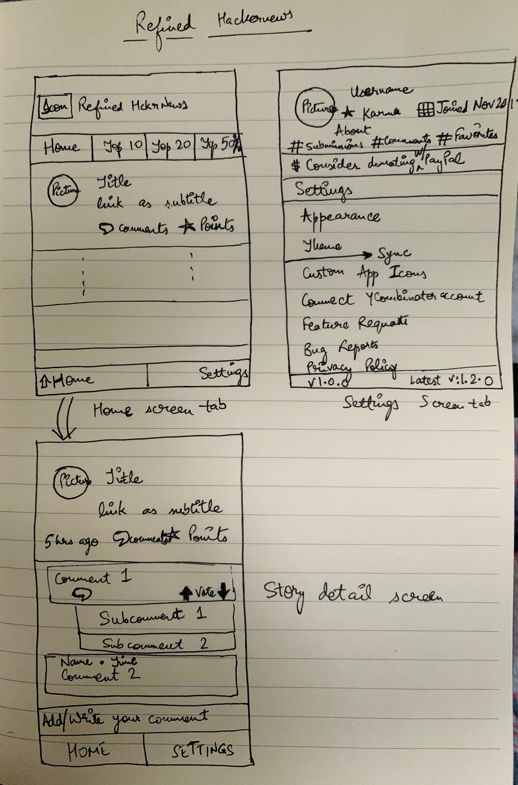

# Refined HackerNews

## Goals

To build a refined, privacy-focused, lightweight and elegant app for reading [Hackernews](https://news.ycombinator.com/), improves on [hckrnews.com](https://hckrnews.com) website

## Motivation

Catching up on hackernews is a painful experience with many websites and apps that fragment the experience instead of streamlining it.  

## Why now?

Most mobile clients lack dark mode functionality and aren't designed so that you can catch up when you missed a few days of news

## Folder structure

- `backend`: folder for backend API server files
- `frontend`: folder for frontend clients in React Native
- `desktop`: folder for desktop clients (in Electron, React or a similar framework)

## User Stories

### Minimum Viable Product (MVP)
The following *required* functionality is completed:
- [ ] User can view the `Home Tab` screen to filter the list of articles by Top 10, Top 20, Top 50%, All
- [ ] User can view the `Story Detail` screen to view the comments and link to article
  - Ability to view/read webpages without leaving the app
- [ ] User can view the `Settings` screen to edit basic settings
	- Appearance (font, text size, reader mode)
	- Theme (light mode / gray mode / OLED dark mode)
	- App Icon (customizable icons for light, dark, colorful and seasonal)
	- Background sync (30mins, 60mins, etc.)
- [ ] User can read the news articles and comments offline (background sync/refresh)
- [ ] User can catch up to missed days of articles/news (yesterday, day before and endless scroll)

### Phase 2
The following *optional* functionality is completed:
- [ ] User can read text summary of article
- [ ] User can search HackerNews from the search tab
- [ ] User can customize the following settings
	- Profile (posts, comments)
	- Connect their YCombinator account
	- Ability to provide feedback/feature requests
	- Ability to donate to cover development costs
- [ ] User can engage on HackerNews similar to [Apollo](https://apolloapp.io/) or [Reddit](https://apps.apple.com/us/app/reddit/id1064216828) official apps
	- Comments
	- Upvote/downvote on comments and articles
	- Writing Editor to comment
	- Tap to collapse/hide a comment thread
- [ ] User can sync their reading across devices
- [ ] User can download iOS/Android app from the App Store or Play Store
	- Conform to iOS 13 SDK
	- Conform to Android 10 SDK

### Future Work
The following *optional* features are implemented:
- [ ] User can view the top comments
- [ ] User can download desktop app from a public AWS S3 bucket
- [ ] User can post an article or write a comment using anonymous/ephemeral account
- [ ] User can explore top writers on HackerNews using the explore tab

## Technology Stack

- Built on [Firebase platform by Google](https://firebase.google.com/)
- Hosted on AWS Lambda or Google App Engine
- Hosted databases such as mLab or RDS
- Hosted exception tracking with sentry.io
- Cloud-native 12-factor backend application

## Detailed Requirements

### Design

**Prototype: Screen mockups of the Refined HckerNews app**

    

Design:
  - Post an ad on Fiverr to get a polished design of the app

Other:
  - Post an ad on Fiverr to get custom app icons for the app

### Development

#### Technical Spec: Technical Approach Description

**Frontend Mobile Apps:**

Most users (or readers) will read HackerNews on mobile apps and so [React Native](https://facebook.github.io/react-native/) is a library that will be help quickly write code for Android and iOS that can be compiled into native-application code. With the community support for React Native, it serves as a great starting point for documentation, tutorials and searching for solutions to common problems. The react native apps can fetch data from [HackerNews API](https://github.com/HackerNews/API) and [HnRSS](https://edavis.github.io/hnrss) where needed.

For phase 2, Google's firebase project provides excellent client libraries that will solve the use-cases of authentication, syncing state/data across devices and keeping track of user profiles. A backend server with text summarizer API written in Python's Flask/Django framework and deployed with [Zappa](https://github.com/Miserlou/Zappa) to AWS Lambda can take as input a URL to an article and respond with summarized text in JSON. [HnRSS](https://edavis.github.io/hnrss) provides an [Algolia API](https://hn.algolia.com/api) to search HackerNews for the search tab.

**Todo (Technical Tasks & Assignees)**
- Discovery:
  - Familiarise with the react native library
  - Develop a Proof of Concept app with react native tutorial/example

###	Testing

User Acceptance Testing
- Collect feedback from product managers
- Collect feedback from beta users

### Deployment
	...

###	Other
	...

###	Out of Scope
	...

## Philosophy

- No advertising on the apps whatsoever
- Minimal and privacy focused analytics on the apps (https://github.com/electerious/Ackee as an alternative for Google Analytics)
- Sign-in with Apple functionality and keep user emails private
- Allow user donations through PayPal to cover cloud hosting costs.
